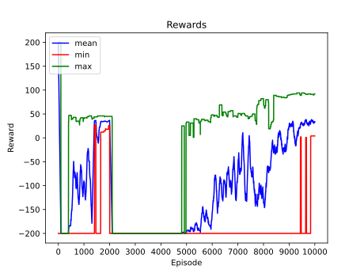
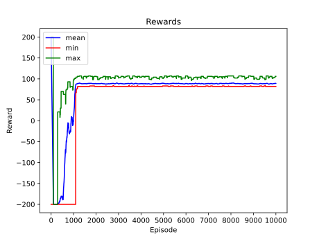
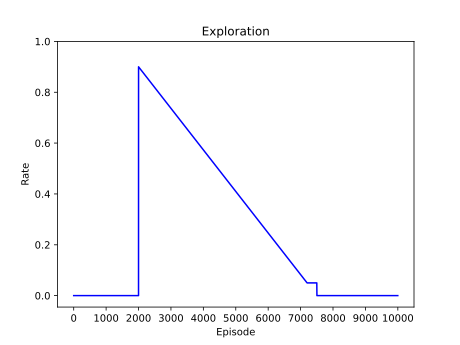
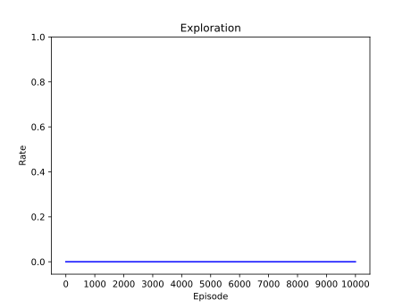

# Updating a Q-table with the Bellman equation

[Gymnasium Mountain Car](https://gymnasium.farama.org/environments/classic_control/mountain_car/) environment was used.

### Results

|                             default                              |                              greedy                              |
|:----------------------------------------------------------------:|:----------------------------------------------------------------:|
|  |  |

Look into the [Graphs](#graphs) section for more info.

### Requirements
To install,
```
pip install -r requirements.txt
```
The [following packages](requirements.txt) were used with Python 3.10+. Feel free to experiment with different versions.
```
gymnasium[classic-control]==0.28.1
opencv-python==4.8.0.74
numpy==1.24.3
pandas==2.0.3
matplotlib==3.7.2
tqdm==4.65.0
```

### Quickstart to Training
_(Assuming the requirements are fulfilled)_
```
python train.py
```
The above commands will do the following.
- [Initialize a Q-table](helpers/q_table_helper.py?plain=1#L10) from random normal distribution with mean -1.0 and standard deviation 0.5
- Start updating the Q-table with the [default training configurations](helpers/config.py).
- Write the configurations to `results/{QTABLE_ID}/{QTABLE_ID}.txt`
- Save the **rewards** and **exploration rate (epsilon)** as `npy` files to `results/{QTABLE_ID}/`
- Save the Q-tables as `npy` files to `q_tables/{QTABLE_ID}/`

### Quickstart to Testing
_(Assuming the requirements are fulfilled)_
```
python test.py
```
The above commands will do the following.
- Load the trained default Q-table.
- Play 1 game and visualize.
- Save the video as a `gif` to `results/{QTABLE_ID}/`

### Graphs

|             Stat              |                          default                          |                          greedy                           |
|:-----------------------------:|:---------------------------------------------------------:|:---------------------------------------------------------:|
| episode reward (moving stats) |       |       |
|       exploration rate        |  |  |

Greedy (exploration rate = 0.0) found a solution and stuck to it.

### Notes
- [test_env.py](helpers/test_env.py) can be used to initially explore the environment.
- [play_mt_car.py](helpers/play_mt_car.py) can be used to control the car with the following keys and play.
  - a: left
  - s: do nothing
  - d: right
- [plot_graphs.py](helpers/plot_graphs.py) can be used to plot graphs from the `rewards.npy` and `explorations.npy` files, and save them as `svg`.
