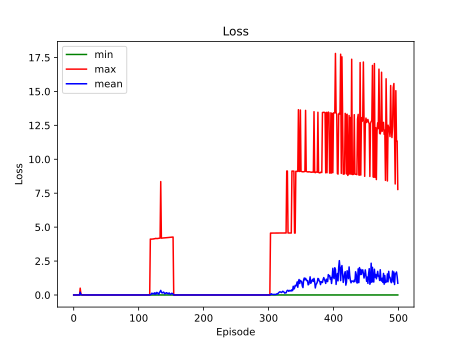

# Deep Q-Networks

[Gymnasium Mountain Car](https://gymnasium.farama.org/environments/classic_control/mountain_car/) environment was used.

### Results

|                                   default                                   |                                   greedy                                    |
|:---------------------------------------------------------------------------:|:---------------------------------------------------------------------------:|
|  |  |

Look into the [Graphs](#graphs) section for more info.

### Requirements
The [following packages](requirements.txt) were used with Python 3.10+.
```
gymnasium[classic-control]
opencv-python
numpy
pandas
matplotlib
tensorflow
tqdm
```

### Quickstart to Training
_(Assuming the requirements are fulfilled)_
```
python train.py
```
The above commands will do the following.
- Initialize 2 identical [neural networks](helpers/dqn_helper.py?plain=1#L38) (policy, target) with 2 fully connected hidden layers.
- Start training policy net and updating target net with the [default training configurations](helpers/config.py).
- Write the model summary and the configurations to `results/{MODEL_ID}/{MODEL_ID}.txt`
- Save the **rewards**, **exploration rate (epsilon)** and **losses** as `npy` files to `results/{MODEL_ID}/`
- Save the policy model as `tf savedModel` to `saved_models/{MODEL_ID}/`

### Quickstart to Testing
_(Assuming the requirements are fulfilled)_
```
python test.py
```
The above commands will do the following.
- Load the trained default saved model.
- Play 1 game and visualize.
- Save the video as a `gif` to `results/{QTABLE_ID}/`

### Graphs

|                Stat                |                               default                                |                                greedy                                |
|:----------------------------------:|:--------------------------------------------------------------------:|:--------------------------------------------------------------------:|
| episode reward <br/>(moving stats) |       |       |
|          exploration rate          |  |  |
|     loss <br/>(episode stats)      |          |          |

By exploring, default configurations found a better solution.

### Notes
- [Deque](helpers/dqn_helper.py?plain=1#L20) (Double Ended Queue) and [Named-tuple](helpers/dqn_helper.py?plain=1#L15) data structures were used to record the transitions into a buffer.
- [plot_graphs.py](helpers/plot_graphs.py) can be used to plot graphs from the `npy` files, and save them as `svg`.
- [test_env.py](../Bellman/helpers/test_env.py) from [Bellman directory](../Bellman/) can be used to initially explore the environment.
- [play_mt_car.py](../Bellman/helpers/play_mt_car.py) from [Bellman directory](../Bellman/) can be used to control the car with the following keys and play.
  - a: left
  - s: do nothing
  - d: right
