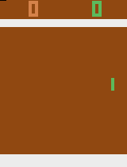
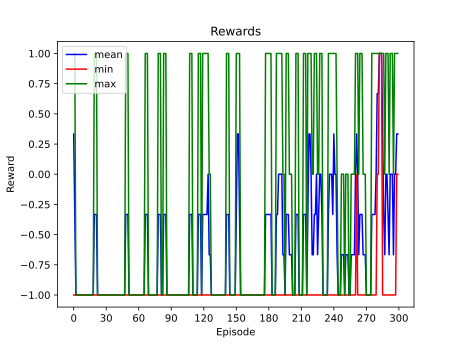
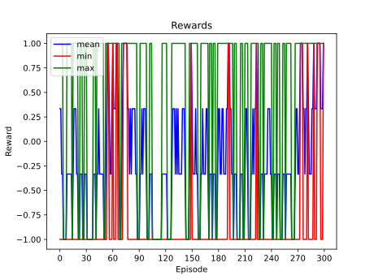
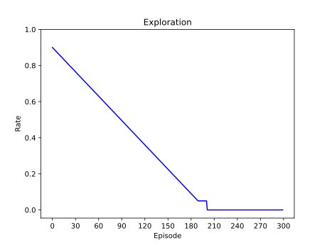
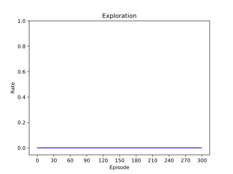
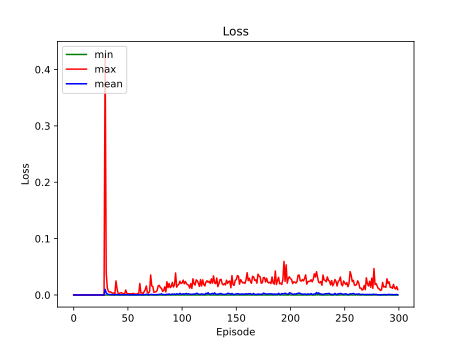
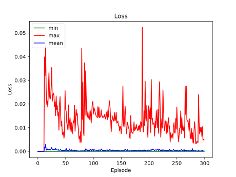

# Atari Pong

A [wrapper](pongWrapper.py) was used on top of [Gymnasium Pong](https://gymnasium.farama.org/environments/atari/pong/) environment to crop out the scoreboard, simplify the colors and truncate the game based on the number of frames and total score.
- Background: Black
- Ball: White
- Opponent: Red
- Agent: Blue

### Results

|                                    Original                                    |                                  Simplified                                   |
|:------------------------------------------------------------------------------:|:-----------------------------------------------------------------------------:|
|  |  |

Look into the [Graphs](#graphs) section for more info.

### Requirements
The [following packages](requirements.txt) were used with Python 3.10+.
```
gymnasium[atari,accept-rom-license]
opencv-python
numpy
pandas
matplotlib
tensorflow
tqdm
```

### Quickstart to Training
_(Assuming the requirements are fulfilled)_
```
python train.py
```
The above commands will do the following.
- Initialize 2 identical [neural networks](helpers/dqn_helper.py?plain=1#L38) (policy, target) with 3 conv layers.
- Start training policy net and updating target net with the [default training configurations](helpers/config.py).
- Write the model summary and the configurations to `results/{MODEL_ID}/{MODEL_ID}.txt`
- Save the **rewards**, **exploration rate (epsilon)** and **losses** as `npy` files to `results/{MODEL_ID}/`
- Save the policy model as `tf savedModel` to `saved_models/{MODEL_ID}/`

### Quickstart to Testing
_(Assuming the requirements are fulfilled)_
```
python test.py
```
The above commands will do the following.
- Load the trained greedy saved model, that was continued from default model.
- Play 1 game and visualize.
- Save the videos (original, simplified) as `gif` to `results/{QTABLE_ID}/`

### Graphs
Truncated to 1 point per game (episode) and 500 average frames per point.

|                Stat                |                               default                               |                   greedy continued from default                    |
|:----------------------------------:|:-------------------------------------------------------------------:|:------------------------------------------------------------------:|
| episode reward <br/>(moving stats) |       |       |
|          exploration rate          |  |  |
|     loss <br/>(episode stats)      |          |          |

It seems the model can be further trained. However, [Google Colab](https://colab.research.google.com) compute time limits had to be considered.

### Notes
- [test_env.py](helpers/test_env.py) can be used to initially explore the environment.
- Original [Gymnasium Pong](https://gymnasium.farama.org/environments/atari/pong/) environment `reset()` method returns different colors than the rest of the frames.
Therefore, in the [wrapper reset() method](pongWrapper.py?plain=1#L74), another `NOOP` (do nothing) step is taken.
- [play_pong.py](helpers/play_pong.py) can be used to control the right paddle with the following keys and play.
  - a: do nothing
  - w: up
  - s: down
- [Deque](helpers/dqn_helper.py?plain=1#L20) (Double Ended Queue) and [Named-tuple](helpers/dqn_helper.py?plain=1#L15) data structures were used to record the transitions into a buffer.
- [plot_graphs.py](helpers/plot_graphs.py) can be used to plot graphs from the `npy` files, and save them as `svg`.
- You can continue training from an existing `savedModel` by setting [CONTINUE_MODEL](helpers/config.py?plain=1#L8-L9) to the `savedModel` directory path.
You may want to change other configurations like [LEARNING_RATE](helpers/config.py?plain=1#L16) and [EXPLORATION_RATE](helpers/config.py?plain=1#L34) too.
