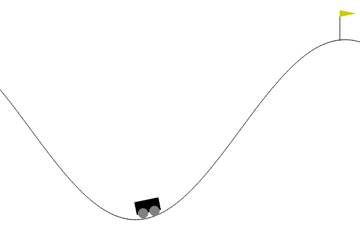
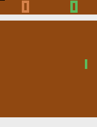

# Q-Learning

### Experimenting With Multiple Reinforcement Learning Environments and Approaches

- [Updating a Q-table with the Bellman equation](Bellman/)
- [Deep Q-Networks](DQN/)
- [Grid World](GridWorld/)
- [Atari Pong](Pong/)

### Some Results
|                                  Mountain Car                                   |                                     Grid World                                     |                                     Atari Pong                                      |
|:-------------------------------------------------------------------------------:|:----------------------------------------------------------------------------------:|:-----------------------------------------------------------------------------------:|
|  |  |  |

### Notes
- [Google Colab](https://colab.research.google.com) compute time limits had to be considered.

### References
- [Gymnasium Documentation](https://gymnasium.farama.org/)
- [LinkedIn Learning](https://www.linkedin.com/learning/certificates/d95c85a360cd55a6b273fe29aa7d4f143afdaf9de8f85d15a5adfdae6f0e6f4e?lipi=urn%3Ali%3Apage%3Ad_flagship3_profile_view_base_certifications_details%3B85h1cMQWR%2BSlcxXDX80vyg%3D%3D)
- [sentdex](https://youtube.com/playlist?list=PLQVvvaa0QuDezJFIOU5wDdfy4e9vdnx-7)
- [PyTorch DQN](https://pytorch.org/tutorials/intermediate/reinforcement_q_learning.html)